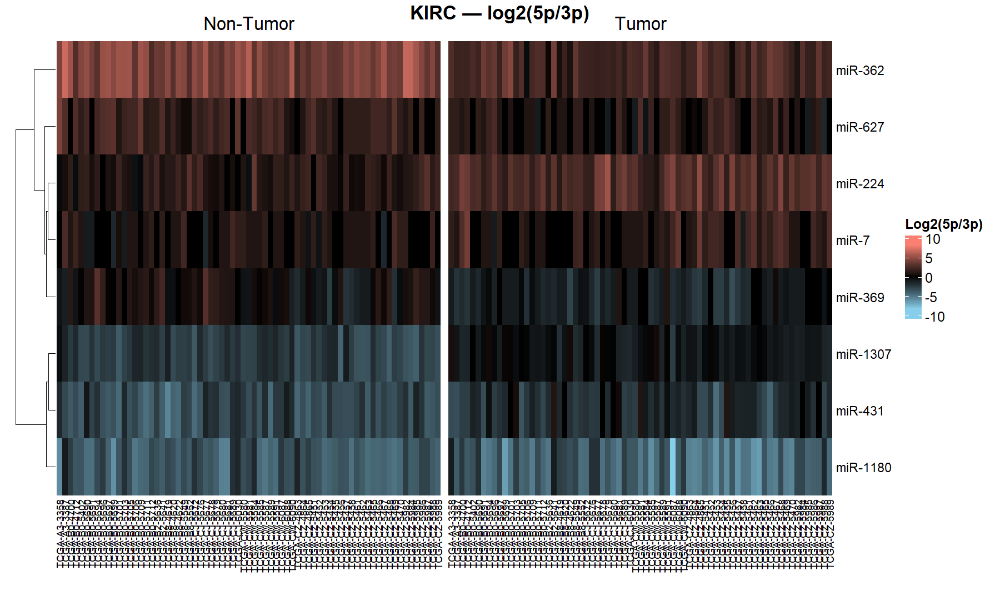
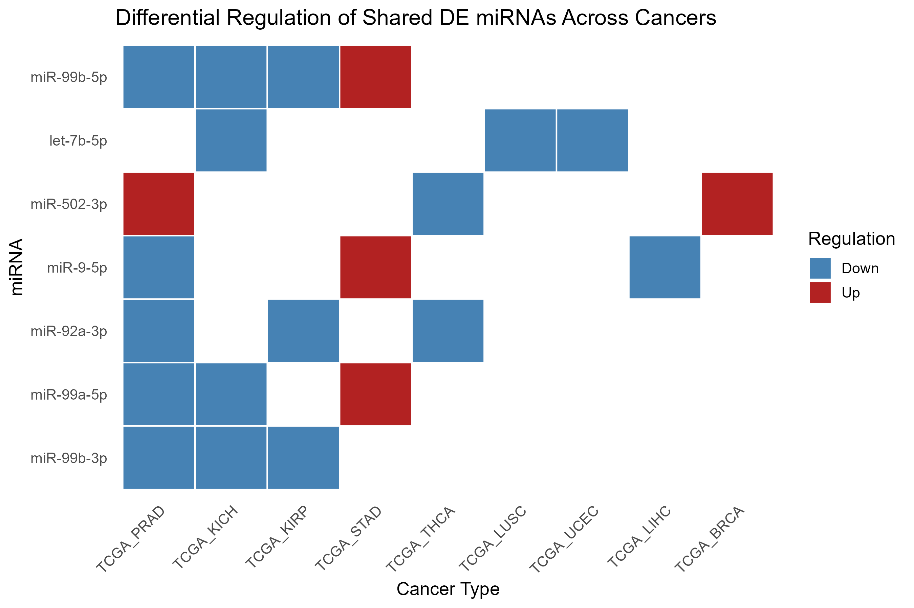

# TCGA miRNA Arm Switching Analysis

## Overview
This repository presents an **R-based bioinformatics pipeline** to identify **microRNA (miRNA) arm usage bias and arm switching** in cancer using **matched tumour–normal samples** from **The Cancer Genome Atlas (TCGA)**.

Rather than analysing miRNAs solely based on total expression, this work focuses on **changes in 5p versus 3p arm dominance** from the same miRNA precursor. Such shifts can reflect **post-transcriptional regulatory rewiring** in cancer that is not captured by conventional differential expression analysis alone.

The pipeline was developed as part of an MSc dissertation in **Health Genomics** and applied initially to **Kidney Renal Clear Cell Carcinoma (TCGA-KIRC)**, followed by a pan-cancer extension.

---

## Biological motivation
Each miRNA precursor can give rise to two mature strands, **5p** and **3p**, which may differ in:

- expression levels,
- tissue specificity, and
- downstream target genes.

In cancer, selective changes in arm usage can occur **without changes in total miRNA abundance**, making arm switching an important but often overlooked regulatory mechanism. This pipeline is designed to detect such shifts in a statistically robust and reproducible manner.

---

## Methods

### Data
- TCGA miRNA-seq count data
- Matched tumour–normal samples per patient
- Mature miRNAs mapped to precursors using a **GFF3 annotation file**

Only patients with **both tumour and normal samples** were retained to enable paired analysis.

---

### Differential expression analysis

Differential expression analysis was performed using **DESeq2** with a paired design:

```r
~ patient_id + condition

```

### miRNA arm usage bias analysis

To quantify tumour-associated changes in arm dominance:

- Mature miRNAs were classified as 5p or 3p

- Read counts were aggregated by:

- miRNA precursor

- tissue condition (tumour vs normal)

- arm (5p vs 3p)

- Arm usage bias was quantified using a log-odds ratio (LOR) comparing tumour and normal tissue

- Statistical significance was assessed using a Z-test and corrected using FDR

This approach enables detection of arm switching independent of overall miRNA expression levels.

### Within-patient arm usage visualisation

Per-sample log2(5p/3p) ratios were calculated and visualised using side-by-side heatmaps for tumour and non-tumour samples. This allows direct comparison of arm dominance within individual patients and highlights consistent cohort-level patterns.

## Results
### TCGA-KIRC: miRNA arm usage bias


**Figure 1:** Volcano plot showing miRNA arm usage bias in TCGA-KIRC. Each point represents a miRNA precursor; the x-axis shows the log-odds ratio (5p vs 3p, tumour vs normal) and the y-axis shows −log10 FDR-adjusted q-values.Positive values indicate increased 5p dominance in tumours, while negative values indicate increased 3p dominance. Several miRNAs (e.g. miR-1307, miR-369, miR-224) exhibit strong and statistically significant arm bias, indicating tumour-associated regulatory shifts.

### TCGA-KIRC: within-patient log2(5p/3p) patterns


**Figure 2:** Side-by-side heatmaps of per-sample log2(5p/3p) ratios in matched tumour and non-tumour samples, highlighting consistent tumour-associated shifts in arm dominance. This heatmap visualises per-sample log2(5p/3p) ratios for selected significant miRNAs across matched tumour and non-tumour samples in TCGA-KIRC.Rows represent miRNA precursors and columns represent individual patients. 

### Pan-cancer: shared miRNA regulation


**Figure 3:** Pan-cancer miRNA arm usage bias across TCGA cohorts.Heatmap shows shared and cancer-type–specific miRNA arm usage bias across multiple TCGA cancers, highlighting both conserved and context-dependent regulatory patterns.The pipeline was extended across multiple TCGA cancer types to identify shared and cancer-specific miRNA regulatory patterns. This analysis highlights both conserved arm usage behaviour across cancers and strong cancer-type specificity for certain miRNAs.

## Repository structure

```text
scripts/        R analysis pipeline
data/           Input data (TCGA files not included)
results/        Output files and plots
annotation/     miRNA annotation (GFF)
figures/        Figures displayed in this README

```

## How to Run 

```
source("scripts/softcode_final.R")
run_arm_bias_pipeline("TCGA_KIRC")
run_all_cancers()
```

## Key packages

DESeq2

ggplot2 / ggrepel

ComplexHeatmap

dplyr / tidyr

## Summary

This repository provides a reproducible framework for studying miRNA arm usage bias and arm switching in cancer. By complementing standard expression-based analyses, this approach offers deeper insight into post-transcriptional regulatory changes and is applicable to both single-cancer and pan-cancer studies.
